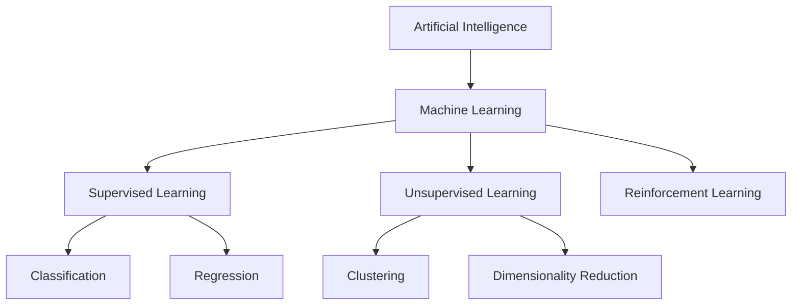
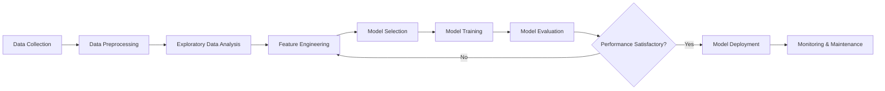
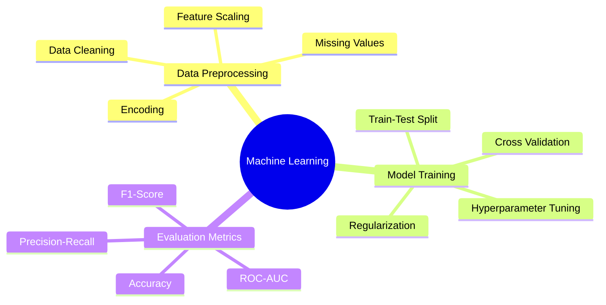
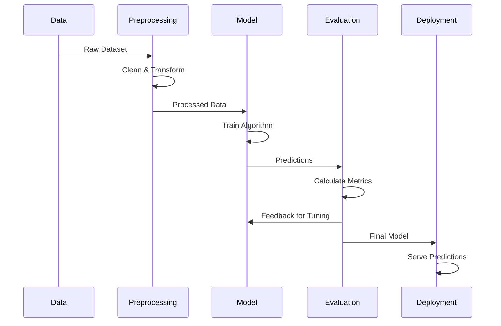

# Machine Learning Projects Portfolio

A comprehensive collection of machine learning projects exploring various algorithms, techniques, and real-world applications across different domains.

---

## Overview

This repository serves as a centralized hub for my machine learning journey, containing multiple projects that demonstrate practical implementations of ML algorithms and methodologies. Each project focuses on solving specific problems using data-driven approaches, ranging from classical machine learning to deep learning techniques.

### What is Machine Learning?

Machine Learning is a subset of artificial intelligence that enables systems to learn and improve from experience without being explicitly programmed. It focuses on developing algorithms that can access data, learn from it, and make predictions or decisions.

## Technology Stack

### Programming Languages
- **Python 3.8+** - Primary language for all ML implementations

### Core ML/DL Frameworks
- **Scikit-learn** - Classical machine learning algorithms
- **XGBoost/LightGBM** - Gradient boosting frameworks

### Data Processing & Analysis
- **Pandas** - Data manipulation and analysis
- **NumPy** - Numerical computations
- **SciPy** - Scientific computing

### Visualization
- **Matplotlib** - Static visualizations
- **Seaborn** - Statistical data visualization
- **Plotly** - Interactive visualizations

### Model Deployment & MLOps
- **Flask/FastAPI** - Model serving and API development
- **Docker** - Containerization
- **MLflow** - Experiment tracking and model management

---

## Machine Learning Workflow

---

## Project Categories

### Supervised Learning
Projects involving labeled datasets where the algorithm learns to map inputs to outputs.

**Applications:**
- Predictive modeling
- Classification tasks
- Regression analysis
- Time series forecasting

### Unsupervised Learning
Projects working with unlabeled data to discover hidden patterns and structures.

**Applications:**
- Customer segmentation
- Anomaly detection
- Data compression
- Pattern discovery

## Key Concepts Explored

## Model Development Pipeline

---

## Skills Demonstrated

- Data preprocessing and feature engineering
- Statistical analysis and hypothesis testing
- Model selection and hyperparameter optimization
- Cross-validation and performance evaluation
- Handling imbalanced datasets
- Model interpretation and explainability
- End-to-end ML pipeline development
- Version control and reproducible research

---

## Performance Metrics

Understanding which metrics to use for different problems:

| Problem Type | Common Metrics |
|-------------|----------------|
| Binary Classification | Accuracy, Precision, Recall, F1-Score, ROC-AUC |
| Multi-class Classification | Accuracy, Macro/Micro F1, Confusion Matrix |
| Regression | MSE, RMSE, MAE, R-squared, MAPE |
| Clustering | Silhouette Score, Davies-Bouldin Index |

---

## Best Practices Followed

- **Reproducibility** - Seed setting and environment documentation
- **Code Quality** - Clean, modular, and well-documented code
- **Version Control** - Git for tracking changes and collaboration
- **Documentation** - Comprehensive README files for each project
- **Experiment Tracking** - Logging parameters, metrics, and artifacts
- **Model Validation** - Proper train-test splits and cross-validation

---

## Future Enhancements

- Integration of MLOps practices
- Real-time model serving capabilities
- Automated machine learning (AutoML)
- Model explainability and interpretability tools
- Production-ready deployment pipelines

---
